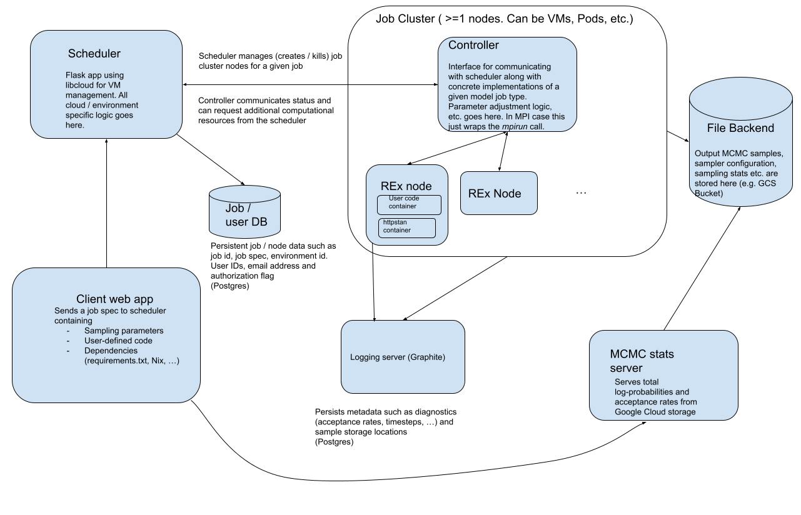

# Chainsail: Replica Exchange sampling as-a-service
Chainsail is a web service which helps you sample from multimodal probability distributions. In the context of Bayesian statistics, they arise in the case of unidentifiable parameters which are due to some symmetry in the model or if you have ambiguous data.

## High-level overview
Also see the [announcement blog post](https://www.tweag.io/blog/2022-08-09-chainsail-announcement/).

Chainsail is essentially a Replica Exchange ([Wikipedia](https://en.wikipedia.org/wiki/Parallel_tempering), [blog post](https://www.tweag.io/blog/2020-10-28-mcmc-intro-4/)) implementation with automated tuning and support for cloud computing platforms providing the necessary parallel computing power.

### Replica Exchange
In a nutshell, Replica Exchange is a Markov chain Monte Carlo (MCMC)  algorithm that works by simulating a series of increasingly "flatter" versions of a probability distribution with a "local" MCMC algorithm such as Hamiltonian Monte Carlo ([blog post](https://www.tweag.io/blog/2020-08-06-mcmc-intro3/)) and occasionally exchanging states between all those simulations.
That way, the Markov chain that samples the distribution of interest can escape from modes it is otherwise likely to be trapped in.
Replica Exchange requires the choice of a series of probability distributions, which interpolate between the target distribution and some very easy to sample, "flat" distribution.
It is convenient to choose a parameterized family of "tempering" distributions and then vary its parameter to set a "schedule".

### User input
The user has to provide a Python module from which the probability distribution they want to sample and a first initial state is imported at runtime.
See [here](https://github.com/tweag/chainsail-resources/blob/main/documentation/defining_custom_probability.md) for details.

The user is furthermore expected to set a few essential parameters for sampling and optimization, although somewhat reasonable defaults are given.
See [here](https://github.com/tweag/chainsail-resources/blob/main/documentation/parameters.md) for the parameters that can be set via the web app and [here](https://github.com/tweag/chainsail/blob/main/docs/algorithmic_parameters.md) for a more complete list of parameters.
Garanteed up-to-date and complete, but somewhat undocumented is the [job specification schema](https://github.com/tweag/chainsail/blob/main/lib/common/chainsail/common/spec.py).

## Service architecture
Chainsail consists of several components as sketched out in the following schema:

The job controller, client, scheduler and MCMC stats server are separate applications and can be found in the `app/` directory.
So is the user code server, which is an app serving log-probabilities, gradients and initial states as defined by the user via gRPCs.
It runs in a Docker container.
The runners, schedule estimation logic and shared code can be found in the `lib/` directory.

Applications and libraries are rather modular and might be reused outside of Chainsail, especially the schedule estimation algorithm can be used with any Replica Exchange implementation.

## Documentation

All applications and library components have more or less detailed READMEs.
The `docs/` directory contains more in-depth documentation on configuring Chainsail components, the full set of sampling parameters setable via the REST API and algorithmic details of the automatic schedule estimation.
Also check the [`chainsail-resources` repository](https://github.com/tweag/chainsail-resources), which contains additional documentation for end users and on algorithms for those who would like to dive a bit deeper.

## Various deployment options

### Terraform / Helm

The full web service (all components sketched in the above service architecture diagram) can be deployed either locally using Minikube or on Google Cloud via Terraform configurations and Helm charts.
Chainsail can be deployed both locally and on Google Cloud. See the [deployment docs](./docs/deployment.md) for more details.

:warning: Note that the web app client interface is _not_ part of this deployment, it has to be run separately.

### Barebone, local controller deployment

The controller component, which performs a single Chainsail sampling job, can be used stand-alone on a single machine for either development / testing purposes or to solve less demanding multimodal sampling problems.
See the [controller README](./app/controller/README.md) for instructions..

# Contributing

We very much welcome your feedback and own contributions to Chainsail in the form of issues and pull requests!
