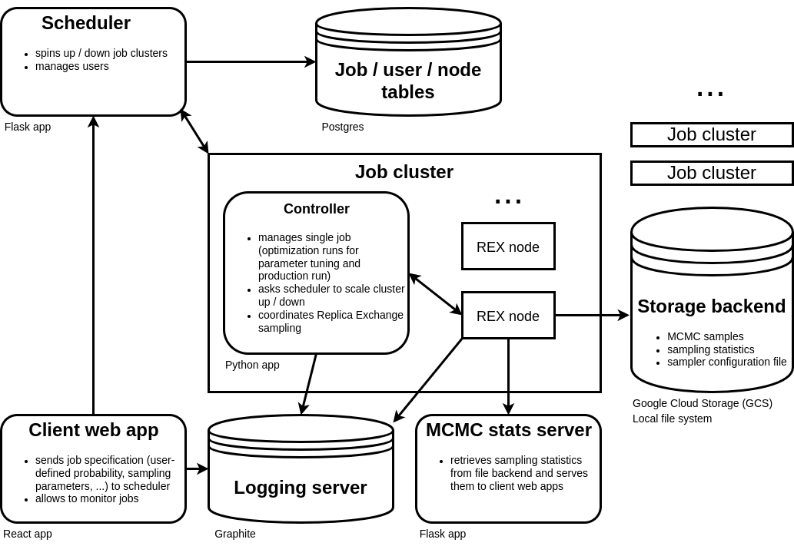

# Chainsail: Replica Exchange sampling as-a-service
Chainsail is a web service which helps you sample from multimodal probability distributions. In the context of Bayesian statistics, they arise in the case of unidentifiable parameters which are due to some symmetry in the model or if you have ambiguous data.

## High-level overview
Also see the [announcement blog post](https://www.tweag.io/blog/2022-08-09-chainsail-announcement/).

Chainsail is essentially a Replica Exchange ([Wikipedia](https://en.wikipedia.org/wiki/Parallel_tempering), [blog post](https://www.tweag.io/blog/2020-10-28-mcmc-intro-4/)) implementation with automated tuning and support for cloud computing platforms providing the necessary parallel computing power.
### Replica Exchange
In a nutshell, Replica Exchange is a Markov chain Monte Carlo (MCMC)  algorithm that works by simulating a series of increasingly "flatter" versions of a probability distribution with a "local" MCMC algorithm such as Hamiltonian Monte Carlo ([blog post](https://www.tweag.io/blog/2020-08-06-mcmc-intro3/)) and occasionally exchanging states between all those simulations.
That way, the Markov chain that samples the distribution of interest can escape from modes it is otherwise likely to be trapped in.
Replica Exchange requires the choice of a series of probability distributions, which interpolate between the target distribution and some very easy to sample, "flat" distribution.
It is convenient to choose a parameterized family of "tempering" distributions and then vary its parameter to set a "schedule".
### Automated schedule tuning
Chainsail automagically finds appropriate schedules via an iterative algorithm which results in approximatively constant acceptance rates between neighboring distributions.

### User input
The user has to provide a Python module from which the probability distribution they want to sample and a first initial state is imported at runtime.
The interface is specified in [./docs/probability_definition].
The user is furthermore expected to set a few essential parameters for sampling and optimization, although somewhat reasonable defaults are given.
See [./examples/local_run/README.md](./examples/local_run/README.md) for an example config file and a list of parameters (TODO: move this to some other place below `./docs/`).

### Various deployment options
Chainsail offers a web client interface for submission of sampling jobs, but can also be talked to via a RESTful API. The controller component, which performs a single sampling job, can be used stand-alone on a single machine for either development / testing purposes or to solve less demanding multimodal sampling problems.
If configured to make use of a cloud computing platform, Chainsail will then automatically create computing resources to run the highly parallel sampling on.
**Be aware that this incurs costs**.
The maximum number of replicas and hence the maximum number of compute nodes can be set by the user.

### Service architecture
Chainsail consists of several components as sketched out in the following schema:

The job controller, the client and the scheduler are separate applications and can be found in the `app/` directory.
The runners, schedule estimation logic and shared code can be found in the `lib/` directory.
All applications and library components have detailed READMEs and might be reused outside of Chainsail (especially the schedule estimation logic is applicable to other Replica Exchange implementations as well).
The `docs/` directory contains more in-depth documentation on configuring Chainsail components, the full set of sampling parameters setable via the REST API and algorithmic details of the automatic schedule estimation.

## Deployment options

Chainsail can be deployed both locally and on Google Cloud. See the [deployment docs](./docs/deployment.md) for more details.

For quickly getting your feet wet with Chainsail, you can run the controller app locally using the instructions [here](./app/controller/README.md).

# Contributing

We very much welcome your feedback and own contributions to Chainsail in the form of issues and pull requests!

# License

**FIXME**

Copyright © 2021–present Tweag I/O
